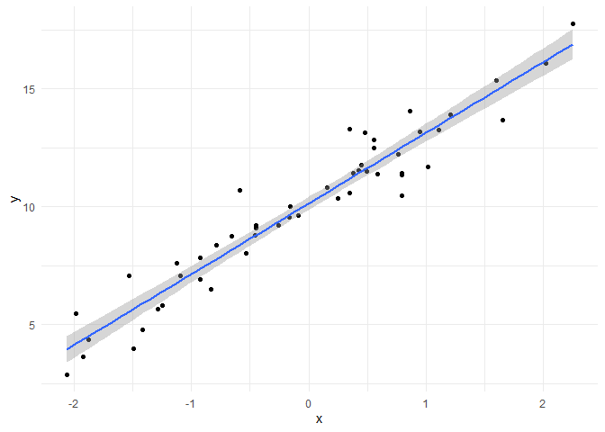

Errata for *Statistics for Linguists: An Introduction Using R*, Bodo
Winter, 2019, Routledge
================
Dan Villarreal  
University of Pittsburgh

Updated 3 February 2022

-   [Chapter 3: Descriptive
    statistics](#chapter-3-descriptive-statistics)
-   [Chapter 4: Introduction to the linear
    model](#chapter-4-introduction-to-the-linear-model)
-   [Chapter 5: Correlation, linear, and nonlinear
    transformations](#chapter-5-correlation-linear-and-nonlinear-transformations)
-   [Chapter 6: Multiple regression](#chapter-6-multiple-regression)
-   [Chapter 7: Categorical
    predictors](#chapter-7-categorical-predictors)
-   [Chapter 8: Interactions and nonlinear
    effects](#chapter-8-interactions-and-nonlinear-effects)
-   [Chapter 9: Inferential statistics
    1](#chapter-9-inferential-statistics-1)
-   [Chapter 10: Inferential statistics
    2](#chapter-10-inferential-statistics-2)
-   [Chapter 11: Inferential statistics
    3](#chapter-11-inferential-statistics-3)
-   [Chapter 12: Generalized linear models
    1](#chapter-12-generalized-linear-models-1)

This document contains errata (and non-error important notes) for the
textbook *Statistics for Linguists: An Introduction Using R* (Bodo
Winter, 2019, Routledge). Please feel free to suggest other errata by
creating a [GitHub
issue](https://github.com/djvill/Winter-2019-Errata/issues).

# Chapter 3: Descriptive statistics

| Page | Text                                                                                                      | Comment                                                                                                                                                                             |
|-----:|-----------------------------------------------------------------------------------------------------------|-------------------------------------------------------------------------------------------------------------------------------------------------------------------------------------|
|   53 | The corresponding histogram is shown in Figure 3.1a (for an explanation of histograms, see Chapter 1.12). | Figure 3.1a is a barplot, not a histogram.                                                                                                                                          |
|   56 | (Footnote 2)                                                                                              | This book uses *N* and *n* interchangeably (including in this footnote). In other texts, *N* refers to the size of a population and *n* to the size of a sample of that population. |
|   64 | `war <- read_csv(' warriner_2013_emotional_valence.csv')`                                                 | There is an extra space after the first quotation mark. This space needs to be removed or else the code will yield an error.                                                        |
|   65 | (Code output at the bottom of the page)                                                                   | **Content warning:** This code output contains the most negative words in the dataframe, and there are some potentially triggering words in here.                                   |

# Chapter 4: Introduction to the linear model

| Page | Text                                                                    | Comment                                                                                                                                                                                                      |
|-----:|-------------------------------------------------------------------------|--------------------------------------------------------------------------------------------------------------------------------------------------------------------------------------------------------------|
|   74 | E4.7: *y* = *b*<sub>0</sub> + *b*<sub>1</sub> \* *x* + *e*              | The error term is sometimes notated as epsilon (*ϵ*), but notated as *e*, it shouldn’t be confused with the natural logarithm base (also notated *e*), which is discussed in section 5.4.                    |
|   75 | Figure 4.6 shows the *SSE* as a function of different slope values.     | Should be Figure 4.5b, not Figure 4.6                                                                                                                                                                        |
|   77 | Conversely, 32% of the variation in response durations is due to chance | Should be 28% (100%$-$74%), not 32%.                                                                                                                                                                         |
|   78 | `plot(x., y, pch = 19)`                                                 | Extra dot. Should be<br>`plot(x, y, pch = 19)`                                                                                                                                                               |
| 81–2 | `# A tibble: 50 x 2`<br>(…)<br>`# ... with 40 more rows`                | The preceding code will yield a tibble with 61 rows, not 50. So your output should be<br>`# A tibble: 61 x 2`<br>(…)<br>`# ... with 50 more rows`                                                            |
|   83 | (Code output starting with `r.squared`)                                 | The alignment of this output apparently got messed up in the book publication process, but your output should be nicely lined up between the labels (like `r.squared`) and the quantities (like `0.9283634`) |
|   83 | The resultant plot will look similar to Figure 4.9                      | There is no Figure 4.9! Your plot will look similar to the following (but not identical, because we didn’t set a random seed):                                                                               |

<!-- -->

# Chapter 5: Correlation, linear, and nonlinear transformations

|  Page | Text                                                                                                                                                                                                                                                                                                                                                                                                                                                                                              | Comment                                                                                                                                                                                                                                                                                                                                                                                                                                                |
|------:|---------------------------------------------------------------------------------------------------------------------------------------------------------------------------------------------------------------------------------------------------------------------------------------------------------------------------------------------------------------------------------------------------------------------------------------------------------------------------------------------------|--------------------------------------------------------------------------------------------------------------------------------------------------------------------------------------------------------------------------------------------------------------------------------------------------------------------------------------------------------------------------------------------------------------------------------------------------------|
| 89–90 | (All of section 5.3)                                                                                                                                                                                                                                                                                                                                                                                                                                                                              | The biggest question I usually get about this chapter is “wait, what’s the connection between correlation and transformations?” And honestly…I don’t think it makes sense to smush these two concepts into a single chapter, because they don’t really make sense together (beyond the fact that they’re both statistical concepts). So if it’s less confusing to you, treat section 5.3 as a kind of mini-separate-chapter within the larger chapter. |
|    92 | The log<sub>10</sub> of 1000 is 3, which is a difference of 998 \[between the logarithm and the raw number\].                                                                                                                                                                                                                                                                                                                                                                                     | Should be 997, not 998.                                                                                                                                                                                                                                                                                                                                                                                                                                |
|    97 | (Code output for `tidy(ELP_mdl)`)                                                                                                                                                                                                                                                                                                                                                                                                                                                                 | Your output will probably have a lot fewer decimal places.                                                                                                                                                                                                                                                                                                                                                                                             |
|   100 | First, compare `xmdl` to `xmdl_c`. There is no change in the slope, but the intercept is different in the centered model. In both models, the intercept is the prediction for *x* = 0, but *x* = 0 corresponds to the average frequency in the centered model. Second, compare `xmdl_c` and `xmdl_z`. The intercepts are the same because, for both models, the predictor has been centered. However, the slope has changed because a change in one unit is now a change in 1 standard deviation. | All the instances of `xmdl` should be `ELP_mdl` (including with the `_c` suffix)                                                                                                                                                                                                                                                                                                                                                                       |

# Chapter 6: Multiple regression

|  Page | Text                                                                                    | Comment                                                                                                                                                                                                                                                                                                                                                                             |
|------:|-----------------------------------------------------------------------------------------|-------------------------------------------------------------------------------------------------------------------------------------------------------------------------------------------------------------------------------------------------------------------------------------------------------------------------------------------------------------------------------------|
|   103 | E6.1: *y* = *b*<sub>0</sub> + *b*<sub>1</sub> \* *x* + *b*<sub>2</sub> \* *x* + *e*     | This equation suggests that *b*<sub>1</sub> and *b*<sub>2</sub> are multiplied by the same predictor *x*. In the case of multiple regression, each predictor has its own coefficient (as in E6.3, bottom of page), so a more accurate form would be *y* = *b*<sub>0</sub> + *b*<sub>1</sub> \* *x*<sub>1</sub> + *b*<sub>2</sub> \* *x*<sub>2</sub> + *e*                           |
|   106 | (Code output for `tidy(icon_mdl)`)                                                      | Your output will probably have a lot fewer decimal places.                                                                                                                                                                                                                                                                                                                          |
| 106–7 | Footnote 2 discussion of rounding                                                       | Two points of clarification about rounding: (1) Rounding should only be done at the *end* of an analysis; any earlier, and you’re losing precision in your calculations, running the risk of a rounding error compounding over the course of many calculations. (2) Rounding should only be done when you want to display numbers as numbers, not when feeding numbers into a plot. |
|   107 | (Footnote 3) A log frequency of 0 corresponds to a raw word frequency of 1, since 100=1 | Missing superscript. Should be<br>A log frequency of 0 corresponds to a raw word frequency of 1, since 10<sup>0</sup>=1                                                                                                                                                                                                                                                             |
|   111 | `for (i in 1:9) plot(rnorm(50), rnorm(50))`                                             | If your Plots pane in RStudio is too small, running this code will yield `"Error in plot.new() : figure margins too large".` If so, just make Plots pane wider/taller.                                                                                                                                                                                                              |

# Chapter 7: Categorical predictors

| Page | Text                                    | Comment                                                                                                                                       |
|-----:|-----------------------------------------|-----------------------------------------------------------------------------------------------------------------------------------------------|
|  120 | (Code output at the bottom of the page) | In more recent `dplyr` versions, we also get a warning message: <br>\``` summarise()` ungrouping output (override with `.groups` argument) `` |

# Chapter 8: Interactions and nonlinear effects

| Page | Text                                                                                                                                                                                          | Comment                                                                                                                              |
|-----:|-----------------------------------------------------------------------------------------------------------------------------------------------------------------------------------------------|--------------------------------------------------------------------------------------------------------------------------------------|
|  140 | `# Groups: Phon, Sem [4]`                                                                                                                                                                     | Your output should omit this line                                                                                                    |
|  142 | However, these are not the average row-wise or column-wise differences, as one also has to include the interaction term (highlighted in bold \[in Table 8.1\]) in calculating these averages. | The interaction term isn’t bolded in Table 8.1. This is the interaction term that’s being referred to:<br>78.4 + 8.0 + (−7.8)+(−4.6) |

# Chapter 9: Inferential statistics 1

<!-- This is a grid table r/t the usual pipe table, since the former supports arbitrary block elements (in this case, a bulleted list): https://pandoc.org/MANUAL.html#extension-grid_tables -->

<table>
<colgroup>
<col style="width: 1%" />
<col style="width: 12%" />
<col style="width: 85%" />
</colgroup>
<thead>
<tr class="header">
<th style="text-align: right;">Page</th>
<th>Text</th>
<th>Comment</th>
</tr>
</thead>
<tbody>
<tr class="odd">
<td style="text-align: right;">161</td>
<td>(Figure 9.2)</td>
<td>According to the equation for Cohen’s <em>d</em> (E9.1), the <em>d</em> values in this figure should be 1, 2, and 6 (there’s probably some rounding in the <em>M</em> values that we’re not shown)</td>
</tr>
<tr class="even">
<td style="text-align: right;">162</td>
<td><code>Cohen's d</code><br><code>d estimate: 1.037202 (large)</code><br><code>95 percent confidence interval:</code><br><code>inf       sup</code><br><code>0.5142663 1.5601377</code></td>
<td>Using the latest version of the <code>effsize</code> package (0.8.1), I get the following instead:<br> <code>Cohen's d</code><br><code>d estimate: -1.070784 (large)</code><br><code>95 percent confidence interval:</code><br><code>lower      upper</code><br><code>-1.5955866 -0.5459824</code></td>
</tr>
<tr class="odd">
<td style="text-align: right;">163</td>
<td>(Equation E9.4)</td>
<td>This equation oversimplifies things a little too much. A more general form would be the following: <br> <span class="math inline"><em>C</em><em>I</em> = [<em>e</em><em>s</em><em>t</em><em>i</em><em>m</em><em>a</em><em>t</em><em>e</em>−<em>C</em><em>V</em>*<em>S</em><em>E</em>,<em>e</em><em>s</em><em>t</em><em>i</em><em>m</em><em>a</em><em>t</em><em>e</em>+<em>C</em><em>V</em>*<em>S</em><em>E</em>]</span>
<ul>
<li>
<span class="math inline"><em>e</em><em>s</em><em>t</em><em>i</em><em>m</em><em>a</em><em>t</em><em>e</em></span> is some sample estimate—which could be a mean (<span class="math inline"><em>x̄</em></span>), a regression coefficient (<span class="math inline"><em>b</em></span>), or some other estimate of a population parameter.
</li>
<ul>
<li>
Equation E9.4 uses the sample mean (<span class="math inline"><em>x̄</em></span>) here, but you can use CIs to estimate population parameters other than the population mean.
</li>
</ul>
<li>
<span class="math inline"><em>C</em><em>V</em></span> is the <em>critical value</em>: the value of the sampling distribution corresponding to the confidence level you specify.
</li>
<ul>
<li>
Equation E9.4 uses 1.96 here, but this is the critical value <em>specifically</em> for a normally-distributed sampling distribution <em>and</em> a 95% confidence level (because 95% of <em>z</em>-scores fall within 1.96 SDs of the mean)
</li>
</ul>
<li>
<span class="math inline"><em>S</em><em>E</em></span> is the standard error, or <span class="math inline">$\frac{sd}{\sqrt{n}}$</span> (<span class="math inline"><em>s</em><em>d</em></span> being the <em>sample</em> standard deviation)
</li>
</ul></td>
</tr>
<tr class="even">
<td style="text-align: right;">167</td>
<td>For <em>t</em> = 1.5, the <em>p</em>-value is <em>p</em> = 0.14</td>
<td>This is true with a sample size of 100. The <em>t</em>-distribution changes shape with different sample sizes (technically, with different “degrees of freedom”, which are closely related to sample size). Smaller samples mean the <em>t</em>-distribution has ‘heavier tails’, which translates to greater <em>p</em>-values for smaller sample sizes (holding <em>t</em> constant). As sample sizes approach infinity, the <em>t</em>-distribution approaches the shape of the normal distribution.</td>
</tr>
<tr class="odd">
<td style="text-align: right;">168</td>
<td>The critical value turns out to be <em>t</em> = 1.98 in this case.</td>
<td>Again, “this case” refers to a sample size of 100 (see above comment). For sample sizes of 10, 30, 100, 300, and 1000, the critical values for an <span class="math inline"><em>α</em></span> level of 0.05 are roughly 2.26, 2.05, 1.98, 1.97, and 1.96 (respectively). Note that the corresponding <span class="math inline"><em>α</em></span> critical value for a normal distribution is 1.96, underscoring the point that larger sample sizes make the <em>t</em>-distribution more like the normal distribution.</td>
</tr>
</tbody>
</table>

# Chapter 10: Inferential statistics 2

No errata found.

# Chapter 11: Inferential statistics 3

| Page | Text                                                                                                                                                                            | Comment                                                                           |
|-----:|---------------------------------------------------------------------------------------------------------------------------------------------------------------------------------|-----------------------------------------------------------------------------------|
|  180 | (Footnote 1)<br>When *p*-values focus on the SER column are very small numbers                                                                                                  | Typo. Should be:<br>When *p*-values are very small numbers                        |
|  182 | For the SER predictor, this interval is \[0.53−1.96\*0.04, 0.53+1.96\*0.04\], which yields the 95% confidence interval \[45, 61\] (with a little rounding).                     | The latter confidence interval should be \[0.45, 0.61\]                           |
|  191 | `CI_tib <- mutate(sense_preds,`<br>`LB = fits – 1.96 * SEs, # lower bound`<br>`UB = fits + 1.96 * SEs)`                                                                         | `sense_preds` should be `CI_tib.` <br>The ‘minus sign’ is actually an en dash (–) |
|  193 | These mappings assign the y-minimum of the error bar to the lower-bound column from the sense_preds tibble (`LB`), and the y-maximum of the error bar to the upper bound (`UB`) | `LB` and `UB` should be `lwr` and `upr`, respectively                             |
|  194 | `levels >= sense_order`                                                                                                                                                         | `>=` should be `=`                                                                |
|  196 | (Code output at the top of the page)                                                                                                                                            | The `Log10Freq` column shouldn’t be duplicated                                    |
|  196 | `geom_ribbon(aes(ymin = LB, ymax = UB),`                                                                                                                                        | `LB` and `UB` should be `lwr` and `upr`, respectively                             |

# Chapter 12: Generalized linear models 1

| Page | Text                                                                                                                            | Comment                                                                                                                                                                                                                                                                      |
|-----:|---------------------------------------------------------------------------------------------------------------------------------|------------------------------------------------------------------------------------------------------------------------------------------------------------------------------------------------------------------------------------------------------------------------------|
|  202 | Even if you supply very extreme values such as 10,000 or –10,000 to `plogis()`, it will always return a number between 0 and 1. | `plogis()` **doesn’t** always return a number between 0 and 1 in the version of R we’re using (4.0.3). `plogis(17)` returns `1`, and while `1 - plogis(17)` is nonzero, `1 - plogis(37)` returns `0`, and `qlogis(1 - plogis(37))` returns `-Inf`.                           |
|  203 | The whole point of talking about log odds is that this puts probabilities onto a continuous scale.                              | This is confusing because probabilities are also continuous. Better stated: Log-odds put probabilities onto an **unbounded** scale, which is more amenable to regression.                                                                                                    |
|  203 | The logistic function is the *inverse* of the log odd function.                                                                 | FYI, in R, the logistic function is `plogis()`; its inverse, the logit or log-odds function, is `qlogis()`. So for example, `plogis(0)` is 0.5, and `qlogis(0.5)` is 0.                                                                                                      |
|  209 | `levels(dative$RealizationOfRecipient)`                                                                                         | `levels(df$myCol)` will throw an error if `myCol` is a character vector, which you can resolve by first converting to a factor: `levels(factor(df$myCol))`. There’s no error with the `dative` dataframe because it’s stored in the `languageR` package with factor columns. |
|  214 | (Footnote 4)                                                                                                                    | This footnote alludes to the distinction between different [levels of measurement](https://en.wikipedia.org/wiki/Level_of_measurement), in particular the difference between *ordinal scales* and *interval/ratio scales*.                                                   |
